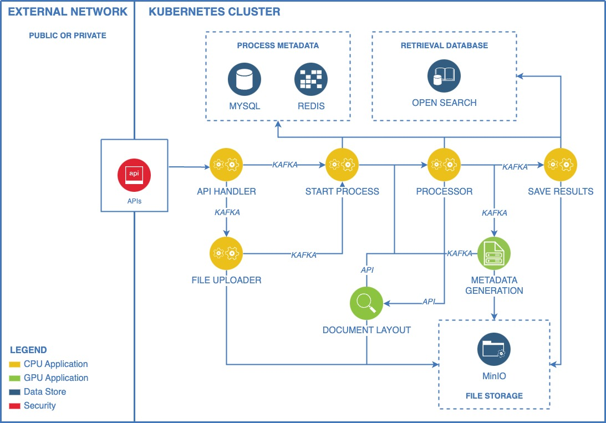
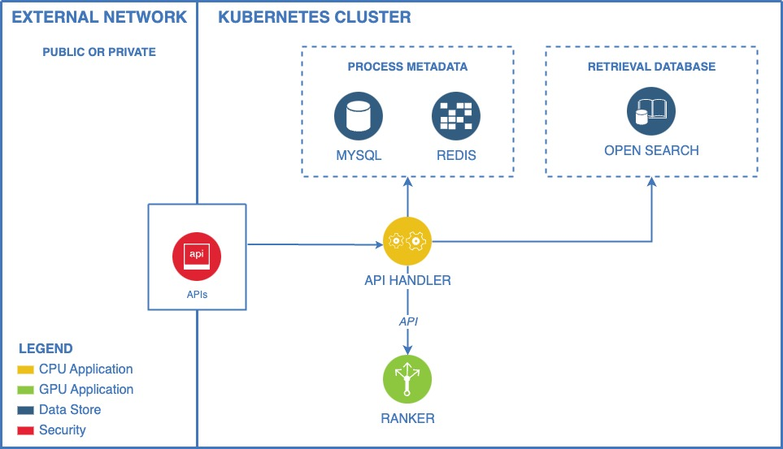

# Table of Contents  
1. [GroundX On-Prem](#groundx-on-prem)
1. [Simple Deployment](#simple-deployment) (from scratch on AWS with minimal configuration)
    1. [Installing Dependencies](#simple-deployment-1-installing-dependencies)
    1. [Setting Up Kubernetes in AWS](#simple-deployment-2-setting-up-kubernetes-in-aws)
    1. [Deploying GroundX On-Prem](#simple-deployment-3-deploying-groundx-on-prem)
    1. [Using GroundX On-Prem](#simple-deployment-4-using-groundx-on-prem)
    1. [Taredown](#simple-deployment-5-taredown)
    1. [A Note on Cost](#a-note-on-cost)
1. [Advanced Deployment](#advanced-setup) (from scratch on AWS with more configuration details)
1. [Deploying to an Existing Kubernetes Cluster](#deploying-to-an-existing-kubernetes-cluster) \<TODO BEN>
1. [The Infrastructure](#the-infrastructure) 
    1. [Ingest Service](#groundx-ingest-service) 
    1. [Search Service](#groundx-search-service) 
1. [Administrative Notes](#administrative-notes)

# GroundX On-Prem

With this repository you can deploy GroundX RAG document ingestion and search capabilities to a Kubernetes cluster in a manner that can be isolated from any external dependencies.

GroundX delivers a unique approach to advanced RAG that consists of three interlocking systems:
1. **GroundX Ingest:** A state-of-the-art vision model trained on over 1M pages of enterprise documents. It delivers unparalleled document understanding and can be fine-tuned for your unique document sets.
1. **GroundX Store:** Secure, encrypted storage for source files, semantic objects, and vectors, ensuring your data is always protected.
1. **GroundX Search:** Built on OpenSearch, it combines text and vector search with a fine-tuned re-ranker model for precise, enterprise-grade results.

In head-to-head testing, GroundX significantly outperforms many popular RAG tools ([ref1](https://www.eyelevel.ai/post/most-accurate-rag), [ref2](https://www.eyelevel.ai/post/guide-to-document-parsing), [ref3](https://www.eyelevel.ai/post/do-vector-databases-lose-accuracy-at-scale)), especially with respect to complex documents at scale. GroundX is trusted by organizations like Air France, Dartmouth and Samsung with over 2 billion tokens ingested on our models.

GroundX On-Prem allows you leverage GroundX within hardened and secure environments. GroundX On-Prem requires no external dependencies when running, meaning it can be used in air-gapped environments. Deployment consists of two key steps:
1. Creation of Infrastructure on AWS via Terraform
2. Deployment of GroundX onto Kubernetes via Helm

Currently only Terraform deployment onto AWS is supported. However, with sufficient expertise GroundX can be deployed onto any compatible Kubernetes environment.

This repo is in Open Beta. Feedback is appreciated and encouraged. To use the hosted version of GroundX visit [EyeLevel.ai](https://www.eyelevel.ai/). For white glove support in configuring this open source repo in your environment, or to access more performant and closed source versions of this repo, [contact us](https://www.eyelevel.ai/product/request-demo). To learn more about what GroundX is, and what it's useful for, you may be interested in the following resources:

- [A Video discussion the importance of parsing, and a comparison of several approaches](https://www.youtube.com/watch?v=7Vv64f1yI0I&t=1108s)
- [GroundX being used to power a multi-modal RAG application](https://www.youtube.com/watch?v=tIiqCG11hzQ)
- [GroundX being used to power a verbal AI Agent](https://www.youtube.com/watch?v=BL2G3C3_RZU&t=300s)

# Simple Deployment
## Simple Deployment 1) Installing Dependencies

Please ensure you have the following software tools installed before proceeding:

1. `bash` shell (version 4.0 or later recommended. AWS Cloud Shell has insufficient resources.)
2. `terraform` ([Setup Docs](https://developer.hashicorp.com/terraform/tutorials/aws-get-started/install-cli)) 
3. `AWS CLI` ([Setup Docs](https://docs.aws.amazon.com/cli/latest/userguide/getting-started-install.html))
4. `kubectl` ([Setup Docs](https://kubernetes.io/docs/tasks/tools/))


## Simple Deployment 2) Setting Up Kubernetes in AWS

First, clone the repo
```
git clone https://github.com/eyelevelai/eyelevel-iac.git
```
Then run

```
cd eyelevel-iac/
cp environment/aws/env.tfvars.example environment/aws/env.tfvars
```

`env.tfvars` is the configuration file terraform will use when defining the resources. The content of `env.tfvars` can be modified to update this configuration as necessary. By copying `env.tfvars.example` to `env.tfvars` you will be using the default configuration.

once `env.tfvars` has been created, run

```
environment/aws/setup-eks
```

You will be prompted for an AWS region to set up your cluster, and will also be asked to double check that you're happy with the state of the configuration file.

Once this command has executed all infrastructural resources will have been created, and you can proceed to deploying GroundX.

## Simple Deployment 3) Deploying GroundX On-Prem


```
cp operator/env.tfvars.example operator/env.tfvars
```

This copies an example config file for the GroundX application, similarly to what was done in step 1. Now, however, some configuration is required.

For security reasons, you **MUST** modify the following:

  - `admin.api_key`: Set this to a random UUID. You can generate one by running `bin/uuid`. This will be the API key associated with the admin account and will be used for inter-service communications.
  - `admin.username`: Set this to a random UUID. You can generate one by running `bin/uuid`. This will be the user ID associated with the admin account and will be used for inter-service communications.
  - `admin.email`: Set this to the email address you want associated with the admin account.

Once `env.tfvars` has been properly configured, run

```
operator/setup
```

This will deploy GroundX On-Prem onto the kubernetes cluster defined in Step 1.

## Simple Deployment 4) Using GroundX On-Prem

Once the setup is complete, run `kubectl -n eyelevel get svc` to get the API endpoint. It will be the external IP associated with the GroundX load balancer.

For instance, the "external IP" might resemble the following:
```    
EXTERNAL-IP
b941a120ecd91455fa7b8682be2a9e41-1427794132.us-east-2.elb.amazonaws.com
```

That endpoint, in conjuction with the `admin.api_key` defined in step 2.1, can be used to configure the GroundX SDK to communicate with your On-Prem instance of GroundX.

```Python
from groundx import Groundx
from groundx.configuration import Configuration

external_ip = 'b941a120ecd91455fa7b8682be2a9e41-1427794132.us-east-2.elb.amazonaws.com'

groundx = Groundx(
    configuration=Configuration(
        host=f"http://{external_ip}/api",
        api_key="xxxxxxxx-xxxx-xxxx-xxxx-xxxxxxxxxxxx",
    )
)
```

## Simple Deployment 5) Taredown
After all resources have been created, taredown can be done with the following commands.

```
bin/operator app -c
bin/operator services -c
bin/operator init -c
bin/environment eks -c
bin/environment aws-vpc -c
```

It is vital to run these commands in order, and it is recommended to run them one at a time manually. We have observed inconsistency and race conditions when these are run automatically.

## A Note on Cost
The resources being created will incur cost via AWS. It is recommended to follow all instructions accurately and completely. So that setup and taredown are both executed completely. Experience with AWS is recommended.

The Default resource configurations are specified [here](https://github.com/eyelevelai/eyelevel-iac/blob/main/README.md#:~:text=configurations%20are%20specified-,here,-%2C%20consisting%20of%3A), consisting of:
```
2x m6a.xlarge
3x t3a.medium
1x g4dn.xlarge
3x g4dn.2xlarge
2x g5.xlarge
~300 GB gp2
```

# Advanced Deployment

The previous sections covered how to setup GroundX with minimal configuration. To get GroundX running in AWS with more configuration options, follow these steps:

- (optional) Set up a VPC, skip to the next step if you would like to use an existing VPC
  1. Copy `environment/env.tfvars.example` to `environment/env.tfvars`
  2. Modify values in `environment/env.tfvars`. The ones we recommend you consider modifying include:
    - (optional) `environment.ssh_key_name`: add the name of an SSH key if you would like to have it added to your Kubernetes nodes
    - (optional) `environment.cluster_role_arns`: add ARNs for roles you would like to grant admin access over the Kubernetes cluster to
  3. Run `bin/environment vpc -t` to do a test dry run to confirm you have configured your `env.tfvars correctly`
  4. Assuming the test dry run executed successfully, run `bin/environment vpc`
  5. The VPC setup process should take ~10 minutes and, at the end, your VPC ID, subnets, and an SSH security group ID should be printed to your terminal window

- (optional) Set up Amazon Elastic Kubernetes Service (EKS) Cluster, skip to the next step if you would like to use an existing Kubernetes cluster
  1. If you have not already done so, copy `environment/env.tfvars.example` to `environment/env.tfvars`
  2. Modify values in `environment/env.tfvars`
    - The ones you **MUST** modify include:
      - `environment.vpc_id`: set this to your VPC ID
      - `environment.subnets`: add a string array of subnet IDs
    - The ones you may want to modify include:
      - (optional) `environment.security_groups`: add 1 or more security group IDs to this array if you would like them to be applied to your nodes
      - (optional) `environment.ssh_key_name`: add the name of an SSH key if you would like to have it added to your Kubernetes nodes (note: you will also need to add a security group with SSH access rules to `environment.security_groups`)
      - (optional) `environment.cluster_role_arns`: add ARNs for roles you would like to grant admin access over the Kubernetes cluster to
  3. From the base folder, run `bin/environment eks -t` to do a test dry run to confirm you have configured your `env.tfvars correctly`
  4. Assuming the test dry run executed successfully, run `bin/environment eks`
  5. The EKS cluster setup process should take ~10 minutes

- Set up EyeLevel services
  1. Run `bin/uuid` to generate **TWO** random UUIDs. Make note of these for later.
  2. Copy `operator/env.tfvars.example` to `operator/env.tfvars`
  3. Modify values in `environment/env.tfvars`
    - The ones you **MUST** modify include:
      - `admin.api_key`: Set this to one of the random UUIDs you generated in step 1. This will be the API key associated with the admin account and will be used for inter-service communications.
      - `admin.username`: Set this to one of the random UUIDs you generated in step 1. This will be the user ID associated with the admin account and will be used for inter-service communications.
      - `admin.email`: Set this to the email address you want associated with the admin account.
  4. From the base folder, run `bin/operator init -t` to do a test dry run to confirm you have configured your `env.tfvars correctly`
  5. Assuming the test dry run executed successfully, run `bin/environment init`. This should take ~1 minute.
  6. Run `bin/operator services -t` to do a test dry run to confirm you have configured your `env.tfvars correctly`
  7. Assuming the test dry run executed successfully, run `bin/environment services`. This should take ~5 minutes.
  8. Run `bin/operator app -t` to do a test dry run to confirm you have configured your `env.tfvars correctly`
  9. Assuming the test dry run executed successfully, run `bin/environment app`. This should take ~10 minutes.

Once GroundX has been deployed, use `kubectl -n eyelevel get routes` to list out all the available routes from the API server, to get the API URL for your deployment, and configure the GroundX client with the API URL and the api key that was defined in configuration.

```
from groundx import Groundx
from groundx.configuration import Configuration

groundx = Groundx(
    configuration=Configuration(
        host="{RESULT FROM GET ROUTES}/api",
        api_key="5c49be10-d228-4dd8-bbb0-d59300698ef6",
    )
)
```

# Deploying to an Existing Kubernetes Cluster
Assuming you have an existing Kubernetes environment, then only the helm operator needs to be installed.

```
<TODO> Sorry Ben, I don't understand enough to know what to write here.

My thinking was, it can be difficult to follow fragmented tutorials, so I made end-to-end documentation for each major use case, and aligned it with the existing documentation.

So, there's three:
1. full setup with little config
2. full setup with a lot of config
3. only deploying GroundX on an existing kubernetes

This is #3, and I don't understand enough to write it.
```

# The Infrastructure
As previously mentioned, this repo consists of two key parts:
1. Creation of Infrastructure on AWS via Terraform
1. Deployment of GroundX onto Kubernetes via Helm

After these two processes are run, A VPC, security groups, API endpoint, and configured EKS environment will be set up. These will be used to power two key services:

### GroundX Ingest Service
The GroundX ingest service expects visually complex documents in a variety of formats. It analyzes those documents with several fine tuned models, converts the documents into a queryable representation which is designed to be understood by LLMs, and stores that information for downstream search.



### GroundX Search Service
Once documents have been processed via the ingest service they can be queried against via natural language queries. We use a custom configuration of Open Search which has been designed in tandem with the representations generated from the ingest service.




# Administrative Notes

The following sections describe the function of a variety of tools and tips which can be used to manage resources within GroundX On-Prem

## VPC and Kubernetes Cluster

`bin/environment` is a script that helps you set up a VPC and Kubernetes cluster. Hosting environments that the script currently supports can be found below.

### Usage

```
bin/environment [component] [options]
```

Component is the cloud environment or Kubernetes cluster configuration you wish to manage.

### Components
- `aws-vpc`
  - This will create a VPC and subnets for an EKS cluster
  - The resulting VPC ID and subnet IDs are required parameters for EKS cluster setup
- `eks`
  - This will set up a new EKS cluster
  - You must configure the `environment` parameters in env.tfvars, including VPC and subnet IDs

### Options

- `-c`: Clear (destroy) mode. Reverses the order of operations and destroys instead of deploys.
- `-t`: Test mode. Skips the Terraform apply/destroy step, useful for dry runs.

### Examples

1. Create a new VPC for EKS cluster setup:
   ```
   bin/environment aws-vpc
   ```

2. Create a new EKS cluster:
   ```
   bin/environment eks
   ```

3. Destroy the EKS cluster:
   ```
   bin/operator eks -c
   ```

4. Test deployment of the EKS cluster without making any changes to the AWS account:
   ```
   bin/operator eks -t
   ```

## EyeLevel Helm Operator

Deployments are managed using the `bin/operator` script found in the root of this repository.

### Usage

```
bin/operator [component] [options]
```

Component is the service, pod, configuration, or functional group you wish to manage.

### Functional Groups
- `init`
- `services`
- `app`

### App Pods
- `groundx`
- `layout-webhook`
- `pre-process`
- `process`
- `queue`
- `summary-client`
- `upload`
- `ranker`
- `layout`
- `summary`

### Init Configurations
- `add`
- `config`

### Services
- `cache`
- `db`
- `file`
- `search`
- `stream`

### Options

- `-c`: Clear (destroy) mode. Reverses the order of operations and destroys instead of deploys.
- `-t`: Test mode. Skips the Terraform apply/destroy step, useful for dry runs.

### Examples

1. Deploy all components:
   ```
   bin/operator
   ```

2. Deploy a specific group:
   ```
   bin/operator services
   ```

3. Deploy a specific app:
   ```
   bin/operator groundx
   ```

4. Destroy a specific service:
   ```
   bin/operator db -c
   ```

5. Test deployment of an init task:
   ```
   bin/operator add -t
   ```

### Customization

To add new components or modify existing ones, update the following arrays in the script:

- `valid_groups`
- `recursive_types`
- `valid_apps`
- `valid_init`
- `valid_services`

Ensure that the directory structure under the `operator/` folder matches these configurations.

### Troubleshooting

1. **"Unknown request type" error**: Check if the component you're trying to deploy/destroy is listed in the appropriate array in the script.

2. **"Directory does not exist" error**: Ensure that the directory structure under `operator/` matches the components defined in the script.

3. **Terraform errors**: Check your Terraform configurations and AWS credentials if you encounter Terraform-specific errors.

4. **Permission issues**: Ensure the script has execute permissions (`chmod +x script_name`).

For any other issues, check the Terraform output for specific error messages and consult the Terraform documentation.